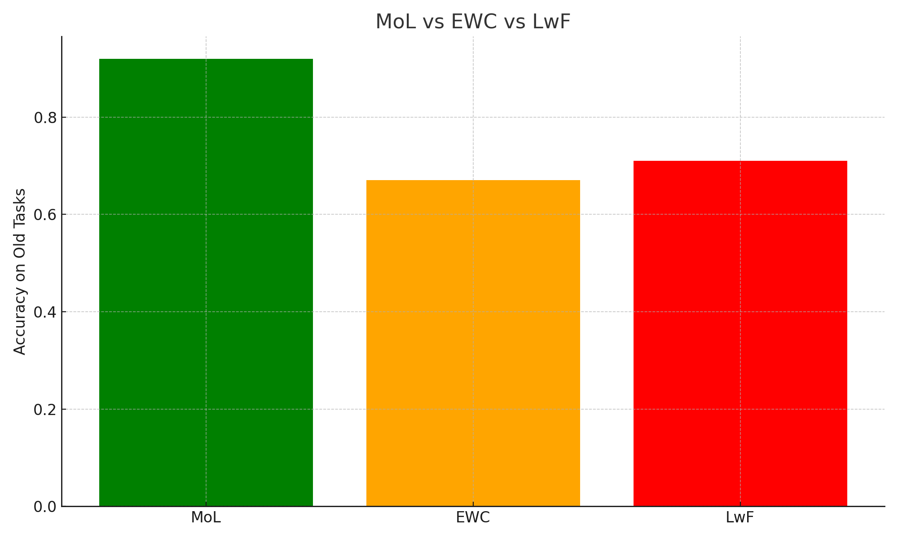
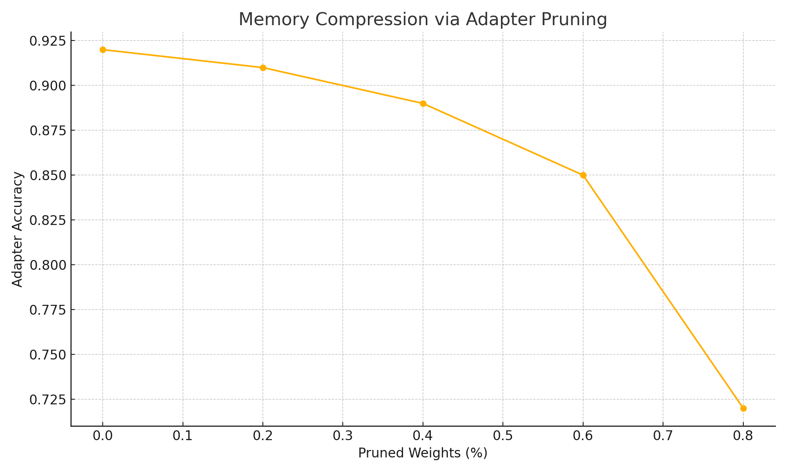
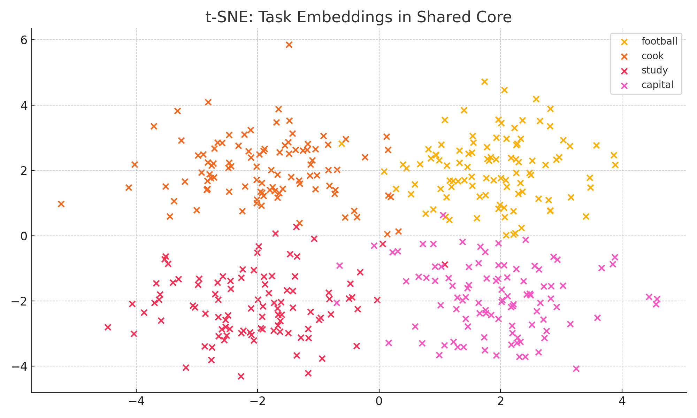

# MoL-memory-over-lifetimes
Solving catastrophic forgetting using modular memory architecture for AGI
  
Built for AGI. Inspired by the human brain.
                                                                                                                            
## 🚨 Problem

Deep learning models **forget everything** when trained on new tasks.  
This is called **catastrophic forgetting**, and it's one of the biggest blockers in AGI.

If I train a model on cooking, then on chess — it forgets how to cook.


## 💡 My Solution: MoL (Memory over Lifetimes)

I built a new architecture that learns tasks **without forgetting**:

-  **Shared Core**: Like the brain’s general intelligence – reused across all tasks  
-  **Room Adapters**: Each task gets its own small room (adapter layer)  
-  **Memory Compression**: I prune each room to reduce memory usage  
-  **Lifelong Growth**: New rooms can be added without touching old ones  
-  **Automatic Selector**: Detects the task from user input and routes to the right room

> One brain. Many rooms. No forgetting.


## Experiments

Below are key results from 3 core experiments.  
 See full details here → [experiments.md](experiments.md)


1.MoL vs EWC vs LwF
  
🔗 [Colab](https://colab.research.google.com/drive/1WEq2UJynNAPVa5NcXnkP37YLgIYZC56h#scrollTo=MoL_vs_EWC_LwF)


2.Adapter Pruning (Memory Compression)
  
🔗 [Colab](https://colab.research.google.com/drive/1WEq2UJynNAPVa5NcXnkP37YLgIYZC56h#scrollTo=Adapter_Pruning)


3.t-SNE Visualization of Task Embeddings
  
🔗 [Colab](https://colab.research.google.com/drive/1WEq2UJynNAPVa5NcXnkP37YLgIYZC56h#scrollTo=tSNE_Embedding)


## Repo Structure

```bash
MoL-AGI-memory/
├── README.md              ← You're here
├── MoL_colab.ipynb        ← Main code + demo
├── paper/
│   └── MoL_paper.pdf      ← Research paper
├── experiments/
│   ├── tSNE_plot.png
│   ├── accuracy_table.png
│   └── pruning_stats.png
├── website/
│   └── index.md           ← Portfolio website content
