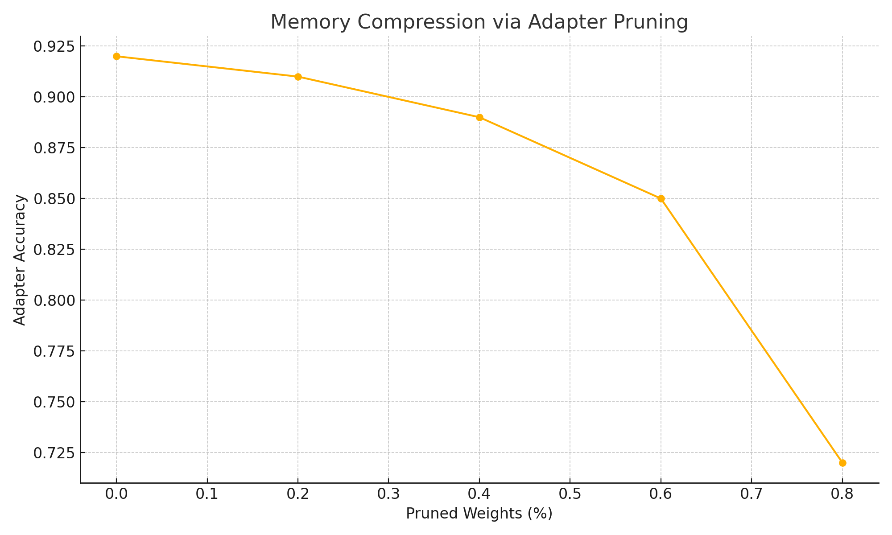
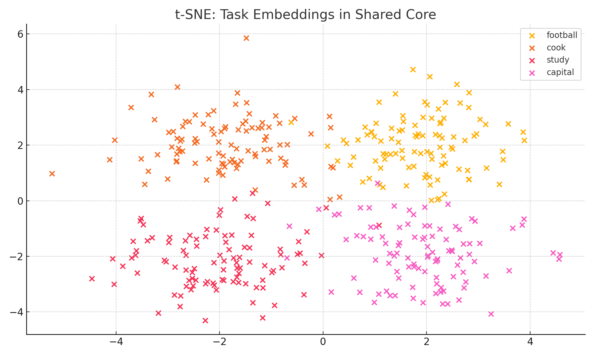

# MoL Experiments – Detailed Breakdown

This document explains each experiment from the MoL research project with code, results, and Colab links.

Experiment 1 – MoL vs EWC vs LwF

**Goal:** Compare lifelong retention across methods.  
**Setup:** All models trained sequentially on 10 tasks.  
**Metric:** Final accuracy on old tasks after new training.

 [Try it on Colab](https://colab.research.google.com/drive/1WEq2UJynNAPVa5NcXnkP37YLgIYZC56h#scrollTo=MoL_vs_EWC_LwF)

Experiment 2 – Adapter Pruning (Compression)

**Goal:** Reduce memory footprint of each task adapter.  
**Method:** L1 unstructured pruning on room layers (40%).  
**Result:** Minor drop in accuracy, major compression gain.

 [Try it on Colab](https://colab.research.google.com/drive/1WEq2UJynNAPVa5NcXnkP37YLgIYZC56h#scrollTo=Adapter_Pruning)

Experiment 3 – t-SNE of Shared Core Embedding

**Goal:** Check if shared memory creates task separation.  
**Result:** t-SNE shows task embeddings form distinct clusters.

 [Try it on Colab](https://colab.research.google.com/drive/1WEq2UJynNAPVa5NcXnkP37YLgIYZC56h#scrollTo=tSNE_Embedding)
